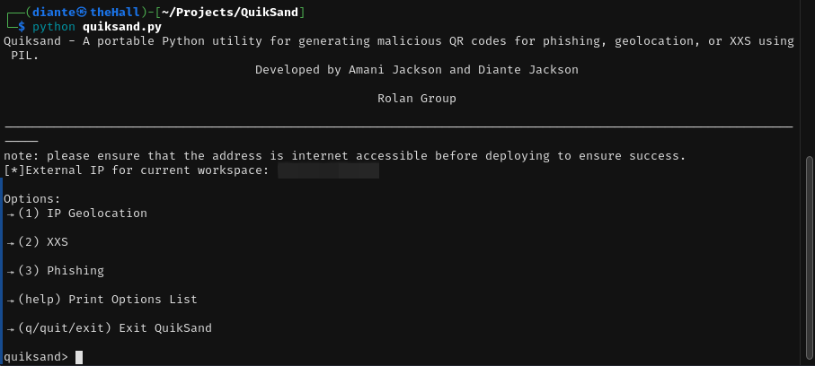

# QuikSand
QuikSand is a social-engineering Python utility for generating malicious qr codes for phishing, geolocation or XXS using PIL, python-requests and PHP. This project was inspired by [The Good, Bad, and Ugly QR code](https://www.uh.edu/infotech/about/presentations/documents/educause2022/qr-code-information.pdf) by Robert Birkline, manager of Web technology at the University of Houston.
## Usage
The QuickSand framework comes with three main tools:

### IP Geolocation
The IP Geolocation social-engineering attack works by taking advantage of the "Location" header in PHP to stealthily obtain information about a target while maintaining secrecy. QuikSand creates a PHP application that acts as an IP logger that queries [IP-API](https://ip-api.com) for an approximate location, ISP data, timezone information and time accessed. It then generates a QR code pointing towards the IP address/hostname that the payload intends on being hosted at. Once that has completed, monitor your webserver's main directory for information as it get's written to the file system!
### XSS
In development!
### Phishing
In development!
## QR Codes and Digital Trust
In the modern era, where everything is digitized and data is available anytime, anywhere, the attack surface and opportunity increases every passing day. As Birkline outlined during his presentation, QR codes, albeit necessary, can present a very large risk to both everyday consumers and corporations alike. Being abused as an attack vector will not only lead to the continued theft and manipulation of consumer/personal information, but a loss of trust and integrity when it comes to corporate infrastructure as well due to something as trivial as a widely available qr code being replaced by one created by a malicious threat actor. This tool aims to enhance upon the adversarial mindset in this situation, opening the door for more organizations to adopt a better practice when it comes to deploying, presenting and securing qr codes and the information given and accessed through them.
## Credits
Again, all credit to Robert Birkline for his presentation as it gave me the idea to pursue this as a quick project and enlighten others about the inherent risk it presents. Credit is also due to [Amani Jackson](https://github.com/AkutoSecurity) for her contributions to this, both programatically and methodologically. This was developed by the Rolan Group.
### DISCLAIMER
Any and all use of QuikSand should have express permission granted prior to engaging. Any malicious or malign use for **ANY** reason is not endorsed, encouraged or allowed.
